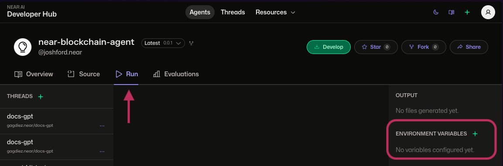

# Secrets & Environment Variables

NEAR AI's environment variable system lets you securely manage configuration and sensitive data for your agents. Both agent developers and users can easily configure variables without modifying the agent's code. 

### Key Features

- [Flexible variable management](#private-variables-secrets): Set and manage variables as agent authors or users
- [Hierarchical variable resolution](#how-variables-are-merged): Users can override agent variables and secrets
- [NEAR wallet-based authentication](#security-authentication): Only authorized users can set and get secrets

---

## Public Variables

Public variables are configuration values that are **visible in code and metadata**. 

### Agent Public Variables

Agent public variables are defined by by the agent author in the agent's `metadata.json` file:

```json
{
  "details": {
    "env_vars": {
      "API_ENDPOINT": "https://api.example.com",
    }
  }
}
```

### User Public Variables

User public variables are set by users via the CLI or URL parameters.

```bash
# Via CLI
nearai agent run my-agent --env_vars='{"CUSTOM_ENDPOINT":"https://api.custom.com"}'

# Via URL parameters
https://app.near.ai/agents/casino.near/game/1?refId=ad.near
```

---

## Private Variables (Secrets)

These are private variables that are securely stored and **never exposed in agent code.**

### Agent Secrets
- Set by agent authors
- Scoped to specific agent versions _(ex: `v0.0.1` vs `v0.0.2`)_

### User Secrets
- Set by users for specific agents
- Can override agent secrets
- Accessible only to authorized runners

---

## How Variables are Merged

It's important to note that at runtime both agent author and user environment variables and secrets are merged into a single `env_vars` object. 

If there are conflicting variables with the same name, user variables will take precedence. This enables agent users to easily override any default value or secret set by the agent author such as an API key or API endpoint.

!!! tip "Priority Order"
    Variables are merged with this priority (highest to lowest), ultimately user variables take precedence:
    
    1. User Public Variables (CLI/URL Params)
    2. User Secrets
    3. Agent Secrets
    4. Agent Public Variables (metadata.json)
    

`Example`:

```python
# Given these variables:
agent_secrets = {"API_KEY": "agent-key"}
agent_public = {"API_KEY": "metadata-key"}
user_secrets = {"API_KEY": "user-key"}
user_public = {"API_KEY": "cli-key"}

# Your agent sees:
env.env_vars["API_KEY"] == "cli-key"  # Highest priority wins
```

---

## Using Variables in Agent Code

Using variables in your agent is straightforward. You can access any variable in your agent code  using Python’s os module or by accessing the `env_vars` dictionary directly using the `env.env_vars` object.

`Examples`:

```python
# Access any variable
api_key = env.env_vars.get('VARIABLE_NAME', 'default-value')

# Using env.env_vars
value = env.env_vars.get('VARIABLE_NAME', 'default_value')

# Using os.environ
import os
value = os.environ.get('VARIABLE_NAME', 'default_value')

# Or using globals()
value = globals()['env'].env_vars.get('VARIABLE_NAME', 'default_value')


```

You can also check if a variable exists:

```python
if 'VARIABLE_NAME' in env.env_vars:
    # Use API key
    api_key = env.env_vars['VARIABLE_NAME']
```

---


## Managing Secrets

All secret variables are managed through the NEAR AI platform and [require a NEAR account to access](#security-authentication). This ensures that only authorized users can access sensitive information and that the variables are stored securely. 

You can manage these secrets at a lower level by using the [secrets API](#secrets-api), but the NEAR AI Developer Hub provides a more user-friendly interface for managing these variables.

### Using Developer Hub

The easiest way to manage variables is through [app.near.ai](https://app.near.ai):

1. Select your agent
2. Click the "Run" tab
3. Under "Environment Variables":
    - Click "+" to add new variable
    - Enter key-value pair
    - Choose visibility (public/private)



### Using CLI

!!! warning "Local Development Only"

For local development and testing only as the CLI does not upload secret variables to the NEAR AI platform. 

Also note that using `--env_vars` flag only works for a single run.

```bash
# Set variables for a single run
nearai agent interactive <AGENT-PATH> --env_vars='{"API_KEY":"sk-...","ENDPOINT":"https://api.custom.com"}'
```

### Secrets API

For programmatic management of secrets, you can use the following API endpoints:

| Endpoint | Method | Description |
|----------|---------|-------------|
| `/v1/get_user_secrets` | GET | Retrieve user secrets |
| `/v1/create_hub_secret` | POST | Create a new secret |
| `/v1/remove_hub_secret` | POST | Delete an existing secret |

---

#### `GET /v1/get_user_secrets`

Retrieves secrets belonging to the authenticated user. (via `owner_namespace`)

Params:

- `limit`: Optional (default: 100)
- `offset`: Optional (default: 0)

**Example Request:**

```bash
curl -X GET "https://<api-url>/v1/get_user_secrets?limit=10&offset=0" \
  -H "Authorization: Bearer <YOUR-NEAR-AUTH-TOKEN>"
```

<details>
<summary>Example response</summary>

```json
[
  {
    "id": 123,
    "owner_namespace": "your_account.near",
    "namespace": "example_agent",
    "name": "my_secret_name",
    "version": "1.0",
    "key": "GITHUB_API_TOKEN",
    "category": "agent",
    "created_at": "2025-02-19T12:34:56.789Z",
    "updated_at": "2025-02-19T12:34:56.789Z"
  }
]
```

</details>

---

#### `POST /v1/create_hub_secret`

Creates a new secret for the authenticated user.

Secrets are tied to:

- A specific version
- A category, such as "agent" or "user" (default is "agent")

**Example Request Body:**

```json
{
  "namespace": "string",      // Required
  "name": "string",           // Required
  "version": "string",        // Optional
  "description": "string",    // Optional
  "key": "string",            // Required
  "value": "string",          // Required
  "category": "string"        // Optional (default: "agent")
}
```

**Example Request:**

```bash
curl -X POST "https://<api-url>/v1/create_hub_secret" \
  -H "Authorization: Bearer <YOUR-NEAR-AUTH-TOKEN>" \
  -H "Content-Type: application/json" \
  -d '{
    "namespace": "example_agent",
    "name": "my_secret_name",
    "version": "0.0.1",
    "description": "GitHub token for my agent",
    "key": "GITHUB_API_TOKEN",
    "value": "ghp_abc123",
    "category": "agent"
  }'
```

**Example Response:**

```json
true
```

---

#### `POST /v1/remove_hub_secret`

Deletes an existing secret.

**Example Request Body:**

```json
{
  "namespace": "string",  // Required
  "name": "string",       // Required
  "version": "string",    // Optional
  "key": "string",        // Required
  "category": "string"    // Optional (default: "agent")
}
```

**Example Request:**

```bash
curl -X POST "https://<api-url>/v1/remove_hub_secret" \
  -H "Authorization: Bearer <YOUR-NEAR-AUTH-TOKEN>" \
  -H "Content-Type: application/json" \
  -d '{
    "namespace": "example_agent",
    "name": "my_secret_name",
    "version": "1.0",
    "key": "GITHUB_API_TOKEN",
    "category": "agent"
  }'
```

**Example Response:**

```json
true
```

---

## Security & Authentication

The [management of secret variables](#managing-secrets) on the NEAR AI platform requires authentication via a NEAR account to ensure that only authorized users can access sensitive information.

Both the NEAR AI CLI & Developer Hub require logging in with a NEAR account and then abstract away the auth token creation process by signing a message with your NEAR wallet. At a low level this authentication is handled by creating an `auth_token` from a signed message which is then passed to all Secret API requests.


`Example`:

```typescript
// Authentication flow
const signature = await wallet.signMessage({
    message: messageToSign,
    recipient: "ai.near",
    nonce: generateNonce(),  // 32-byte random nonce
});

const authToken = {
    account_id: wallet.accountId,
    public_key: wallet.publicKey,
    signature: signature,
    message: messageToSign,
    nonce: nonce,
    recipient: "ai.near"
};
```

### Security Model
1. **Access Control**
    - Variables are scoped to specific agents/users
    - Each agent only sees its own variables
    - User variables override agent variables

2. **Request Security**
    - All requests require NEAR wallet signature
    - Nonces prevent replay attacks
    - Rate limiting on failed attempts
    - Request logging and monitoring

!!! warning "Security Best Practices"
    - Never commit secrets to source code
    - Use descriptive key names
    - Validate required variables exist
    - Handle API errors gracefully
    - Cache secret existence checks
    - For use cases that need higher security secret handling, run your agent in a TEE and verify the TEE quote attestation (docs coming soon).

