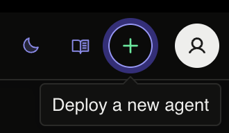

# NEAR AI Agent Examples

Below you will find a list of easy-to-use agent templates as well as more comprehensive agent examples you can review, modify, and deploy.

## Agent Templates

Ready-to-use Agent Templates to quickly get started.

| Template | Description | Link |
|------------|-------------|------|
| NEAR Blockchain | Agent that can view and perform transactions on the NEAR Blockchain. | [View](https://app.near.ai/agents/zavodil.near/near-agent/latest) |
| Twitter / X | Agent that listens for and responds to twitter mentions.  | [View](https://app.near.ai/agents/flatirons.near/near-secret-agent/latest)
| AgentKit | For use with Langchain, LangGraph, & Coinbase's Agentkit | [View](https://app.near.ai/agents/antonlomonos.near/cdp_langchain_chatbot_example_usage/latest)
| TypeScript | Create an AI agent using TypeScript. | [View](https://app.near.ai/agents/zavodil.near/cdp-agent/latest)

!!! info
    { width=200px align=right style="border-radius: 10px;" }

    You can deploy these templates right from the [NEAR AI App](https://app.near.ai). 
    
    Just click the plus sign in the upper right hand corner. 
---

## Agent Examples

Community created agent examples to help you understand how to build on NEAR AI and showcase what's possible.

### General Purpose Agents

| Example | Description | Link | Category |
|----------|---------|-------------|------|
| AI Product Manager | Agent that helps with product management tasks | [View](https://app.near.ai/agents/zavodil.near/pm-agent/latest) | Productivity |
| Image Processing | Agent for handling and processing images | [View](https://app.near.ai/agents/alomonos.near/send_jpg_agent/latest) | Images |
| Agent Builder | Agent that can build other agents | [View](https://app.near.ai/agents/kirikiri.near/agents-builder/latest) | Coding |
| Shopping Agent | Agent for shopping and product recommendations | [View](https://app.near.ai/agents/flatirons.near/sound-sage/latest) | E-commerce |

### Blockchain Enabled Agents

 | Example | Description | Link |
|---------|-------------|------|
| Linkdrop Agent | Agent for creating and managing linkdrops | [View](https://app.near.ai/agents/frol.near/1t-agents-linkdrops/latest) |
| AI AMM | AI-powered Automated Market Maker Agent | [View](https://github.com/zavodil/ai-amm/tree/main) |
| AMM Agent | Automated Market Maker Agent | [View](https://app.near.ai/agents/zavodil.near/amm/latest/source) |
| Memecoin Creation | Agent for creating and managing memecoins | [View](https://app.near.ai/agents/jayzalowitz.near/memecoin_agent/latest) |

- For more examples, see [NEAR AI Official Agents](https://github.com/nearai/official-agents).

---

!!! note "Getting Started"

    New to NEAR AI? Check out our [quickstart guide](../../agents/quickstart.md) to get up and running with your first agent.
