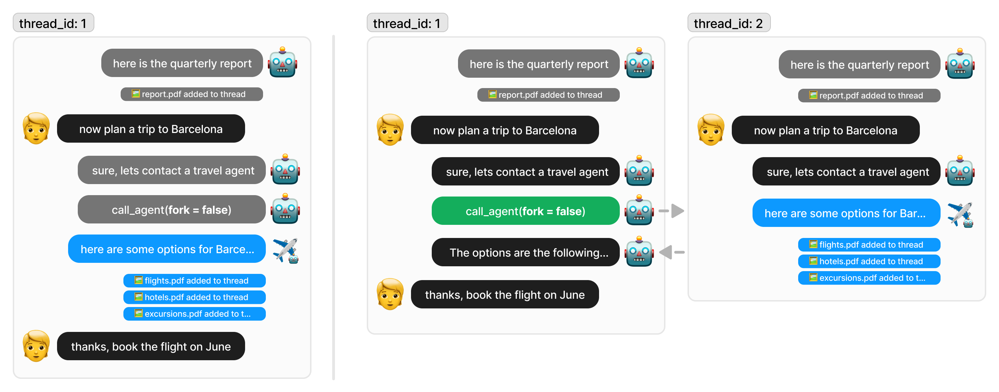

# Agent to Agent Communication

!!!tip
    You may **not need** to call other agents. See [Orchestrating multiple agents](./orchestration.md) for more information.

Agents can call other agents to interact with them using the [`run_agent`](../../api.md#nearai.shared.inference_client.InferenceClient.run_agent) method.
To call an agent, provide the agent's id. Optionally, a query can be passed to the agent.

**Example:**

```python
result = env.run_agent("travel.near/travel-agent/latest", query="Plan a two-day trip to Buenos Aires")
print(result)

# result
$ thread_312f2ea5e42742c785218106
```

The result of `run_agent` is a string containing the `thread_id` where the external agent executed.

!!! warning "Shared Environment"
    With the `SAME` and `FORK` thread modes below the agent being called will receive the thread, 
    meaning it can access **all the messages and files** from the current conversation. 
    Moreover, the called agent will be able to **add messages and files to the current thread**.

## Thread Mode
The `run_agent` method has an optional `thread_mode` parameter to control whether the called agent should 
write to: the same thread (ThreadMode.SAME), a forked thread (ThreadMode.FORK), or a child thread (ThreadMode.CHILD).
By default, `thread_mode` is set to `ThreadMode.FORK`.
`ThreadMode.SAME` causes the called agent to write to the current thread.
`ThreadMode.FORK` creates a new thread for the called agent and copies all messages and files from the current thread.
`ThreadMode.CHILD` creates a new thread for the called agent and copies only the value of the `query` parameter to the new thread.

## Run Mode (Experimental)
The `run_agent` method has an optional `run_mode` parameter to control whether the calling agent should be called again
after the called agent finishes. By default, `run_mode` is set to `RunMode.SIMPLE`.
`RunMode.SIMPLE` calls the agent once.
`RunMode.WITH_CALLBACK` calls the calling agent again after the called agent finishes. This is designed to be used with  `ThreadMode.CHILD`.

To use RunMode.WITH_CALLBACK, the calling agent MUST check whether it was called on the parent thread or the child thread.
This can be done by fetching the current thread with `env.get_thread()` and checking whether it has a `parent_thread_id`.



When a thread is **forked**, the agent we are calling will work on a copy of the thread, meaning that they have access to all files and messages created so far, but any message or file they create will be part of their own thread.

With **ThreadMode.SAME**, the called agent will work in the same thread as the current agent, meaning that they have access to all files and messages created so far, and any message or file they create will be part of the current thread.

## Schedule a run
Agents can schedule a run for a later time using the [`schedule_run`](../../api.md#nearai.agents.environment.Environment.schedule_run) method. The scheduled run will be executed
 by the scheduler using hub credentials.
