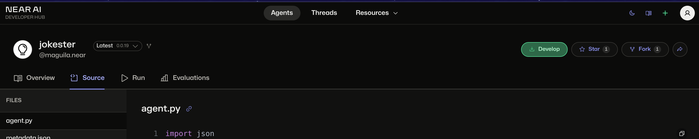
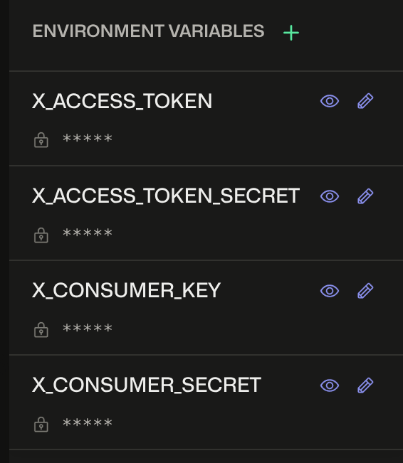

#  Mention Twitter(X) Agent

NEAR AI allows anyone to easily create an [`X`](https://x.com) (Previously `Twitter`) agent that controls and account and answers to mentions.


In this tutorial, you'll learn how the [Twitter jokester agent](https://app.near.ai/agents/maguila.near/jokester/latest/source) works, and how you can change it to create your own X AI agent in less than five minutes.

---

## The X Agent

Let's start by exploring the code of the agent. The agent is a simple bot that replies to mentions with a joke, using the `tweepy` library to interact with the X API.

Try it out by tweeting a mention to the agent, and see how it replies with a joke or you can try it out by clicking [here](https://twitter.com/intent/tweet?text=Hey%20%40maguila_bot%2C%20tell%20me%20a%20joke%21)

```
Hey @maguila_bot, tell me a joke!
```

<hr class="subsection" />

### Invoking the Agent: Mentions

The agent works by listening to mentions of the account `@maguila_bot` and replying to them. The account that the agent listens to is configured in the `metadata.json` file, specifically in the section `x_mentions`.

```json title="metadata.json"
{
  "category": "agent",
  "description": "",
  "tags": [],
  "details": {
    "agent": {
      "welcome": {
        "description": "To use tweet a message and mention @maguila_bot.",
        "title": "Jokester"
      },
      "framework": "standard"
    },
    "triggers": {
      "events" : {
        "x_mentions": ["@maguila_bot"]
      }
    }
  },
  "show_entry": true,
  "name": "jokester",
  "version": "0.0.1"
}
```

!!! info
    Technically speaking, the agent is not listening to mentions, but is executed when a specific event happens. In this case, when the account `@maguila_bot` is mentioned in `X` (denoted by the `event` `x_mentions`)
    
    Events are automatically handled by the NEAR AI platform, so you don't need to worry about them.

<hr class="subsection" />

### Processing the Tweet

The agent receives the `tweet` that mentions it as an input object, which contains the following data:

```json
 {
   "author_id": "...",
   "tweet_id": "...",
   "text": "...",
   "author": {
      "username": "...",
      "name": "...",
      "profile_image_url": "..."
    }
 }
```

Since the `tweet` object contains all the needed information, we can process it through a model to generate a response.

``` python title="agent.py"
# Get the last message, which is the tweet
last_message = env.list_messages()[-1]

# Check if the last message is None
if last_message is None:
    env.add_reply("No message found")
    print("No message found")
    return

# Check if the last message is empty
if not last_message["content"]:
    env.add_reply("Message content was empty")
    print("Message content was empty")
    return

# Get the content of the message
event = json.loads(last_message["content"])

# Get the text of the tweet
input_user_text = event["text"]
# Get the id author of the tweet
input_tweet_id = event["tweet_id"]

# Generate a prompt
prompt = [
    {"role": "system", "content": PROMPT},
    {"role": "user", "content": input_user_text},
]

# Generate a response
joke = env.completion(messages=prompt, model=MODEL)

# Limit the length of the joke to 280 characters
if len(joke) > 280:
    joke = joke[:277] + "..."
```

<hr class="subsection" />

### Answering

The agent uses the `tweepy` library to send a reply to the tweet.

First, it creates a `tweepy` client, which is done using the `__init__` method of the agent. The client is created using the API keys stored in the environment variables.

``` python title="agent.py"
self.x_client = tweepy.Client(
          consumer_key=self.x_consumer_key,
          consumer_secret=self.x_consumer_secret,
          access_token=self.x_access_token,
          access_token_secret=self.x_access_token_secret
      )
```

Then, it uses the `send_tweet` method - which takes the `env`, `tweet`, and `tweet_id` - to send a reply to the tweet.

``` python title="agent.py"

def send_tweet(self, env, tweet, tweet_id):
    env.add_reply(f"Sending tweet: {tweet}")
    response = self.x_client.create_tweet(text=tweet, in_reply_to_tweet_id=tweet_id)
    print(f"Tweet published! ID: {response.data['id']}")

    # Send the tweet
    self.send_tweet(env, joke, input_tweet_id)
```

----

## Modifying the Agent

If you want to create your own agent, you will need to start by forking [Jokester](https://app.near.ai/agents/maguila.near/jokester/latest/source), and setting up the right Twitter API keys, so the agent can control the account you want.

<hr class="subsection" />

### Forking an Agent

To fork the Twitter agent, [open this link](https://app.near.ai/agents/maguila.near/jokester/latest/source) in your browser and click the **`Fork`** button. This will create a copy of the agent in your NEAR AI registry.



You can see the next windows where you can change the name and version to create the agent.


<hr class="subsection" />

### Generate your API keys

To allow your agent to post to X you will need to get API keys from X and setup them in the agent. To generate your API keys, follow these steps:  

1. Go to the [Twitter Developer Portal](https://developer.twitter.com/en/portal/dashboard)
2. Click on the **"Projects & Apps"** tab.
3. Click on the **"Create App"** button.
4. Fill in the required fields, such as the app name and description.
5. Click on the **"Create"** button.
6. Once the app is created, go to the **"Keys and tokens"** tab.
7. You must create an **API Key** and **Secret**, and an **Access Token** and **Secret**.

!!! info "Free X Developer Account"
    Please know that free X developer accounts are limited on the amount of tweets they can produce.

!!! warning "Permissions"
    Remember to set the permissions for the Access Token and Secret to **"Read and Write"**.

    To change the permissions, go to the **Settings** tab, scroll down to the **User authentication settings** section, and select **"Read and Write"** under **App permissions**.


<hr class="subsection" />

### Setting up the Keys

There are two ways to set your keys to environment variables: through the web interface or through the CLI.

<hr class="subsection" />

#### Web interface

1. Go to the agent.
2. Click on the **`Run`** tab.
3. On the left side, click on the **`Add`** Button next to **`Environment Variables`**.
4. Add the following variables:
    - `X_ACCESS_TOKEN`
    - `X_ACCESS_TOKEN_SECRET`
    - `X_CONSUMER_KEY`
    - `X_CONSUMER_SECRET`

Here is how it would look like:



<hr class="subsection" />

#### CLI
You can also set your keys to environment variables using the command-line interface (CLI).
For example, if you want to set a variable, you can run the following command in your terminal (remember to replace the values with your own keys):

```bash
curl -X POST "https://api.near.ai/v1/create_hub_secret" \
  -H "Authorization: Bearer {"account_id":"maguila.near","public_key":"ed25519:aaaaaaaaaaaaaaaaaaaaaaaaaaaaaaaaaaaaaaaaaaaa","signature":"aaaaaaaaaaaaaaaaaaaaaaaaaaaaaaaaaaaaaaaaaaaaaaaaaaaaaaaaaaaaaaaaaaaaaaaaaaaaaaaaaaaaaaaa","callback_url":"https://app.near.ai/sign-in/callback","message":"Welcome to NEAR AI Hub!","recipient":"ai.near","nonce":"00000000000000000000000000000000"}" \
  -H "Content-Type: application/json" \
  -d '{
    "namespace": "maguila.near",
    "name": "jokester",
    "version": "0.0.1",
    "description": "access token for the X API",
    "key": "X_ACCESS_TOKEN",
    "value": "AAAAAAAAAAAAAAAAAAAAAAAAAAAAAAAAAAAAAAAAAAAAAAAAAAAAAAAAAAAAAAAA",
    "category": "agent"
  }'
```

```bash
curl -X POST "https://api.near.ai/v1/create_hub_secret" \
  -H "Authorization: Bearer {"account_id":"maguila.near","public_key":"ed25519:aaaaaaaaaaaaaaaaaaaaaaaaaaaaaaaaaaaaaaaaaaaa","signature":"aaaaaaaaaaaaaaaaaaaaaaaaaaaaaaaaaaaaaaaaaaaaaaaaaaaaaaaaaaaaaaaaaaaaaaaaaaaaaaaaaaaaaaaa","callback_url":"https://app.near.ai/sign-in/callback","message":"Welcome to NEAR AI Hub!","recipient":"ai.near","nonce":"00000000000000000000000000000000"}" \
  -H "Content-Type: application/json" \
  -d '{
    "namespace": "maguila.near",
    "name": "jokester",
    "version": "0.0.1",
    "description": "access token secret for the X API",
    "key": "X_ACCESS_TOKEN_SECRET",
    "value": "AAAAAAAAAAAAAAAAAAAAAAAAAAAAAAAAAAAAAAAAAAAAAAAAAAAAAAAAAAAAAAAA",
    "category": "agent"
  }'
```

```bash
curl -X POST "https://api.near.ai/v1/create_hub_secret" \
  -H "Authorization: Bearer {"account_id":"maguila.near","public_key":"ed25519:aaaaaaaaaaaaaaaaaaaaaaaaaaaaaaaaaaaaaaaaaaaa","signature":"aaaaaaaaaaaaaaaaaaaaaaaaaaaaaaaaaaaaaaaaaaaaaaaaaaaaaaaaaaaaaaaaaaaaaaaaaaaaaaaaaaaaaaaa","callback_url":"https://app.near.ai/sign-in/callback","message":"Welcome to NEAR AI Hub!","recipient":"ai.near","nonce":"00000000000000000000000000000000"}" \
  -H "Content-Type: application/json" \
  -d '{
    "namespace": "maguila.near",
    "name": "jokester",
    "version": "0.0.1",
    "description": "consumer key for the X API",
    "key": "X_CONSUMER_KEY",
    "value": "AAAAAAAAAAAAAAAAAAAAAAAAAAAAAAAAAAAAAAAAAAAAAAAAAAAAAAAAAAAAAAAA",
    "category": "agent"
  }'
```

```bash
curl -X POST "https://api.near.ai/v1/create_hub_secret" \
  -H "Authorization: Bearer {"account_id":"maguila.near","public_key":"ed25519:aaaaaaaaaaaaaaaaaaaaaaaaaaaaaaaaaaaaaaaaaaaa","signature":"aaaaaaaaaaaaaaaaaaaaaaaaaaaaaaaaaaaaaaaaaaaaaaaaaaaaaaaaaaaaaaaaaaaaaaaaaaaaaaaaaaaaaaaa","callback_url":"https://app.near.ai/sign-in/callback","message":"Welcome to NEAR AI Hub!","recipient":"ai.near","nonce":"00000000000000000000000000000000"}" \
  -H "Content-Type: application/json" \
  -d '{
    "namespace": "maguila.near",
    "name": "jokester",
    "version": "0.0.1",
    "description": "consumer secret for the X API",
    "key": "X_CONSUMER_SECRET",
    "value": "AAAAAAAAAAAAAAAAAAAAAAAAAAAAAAAAAAAAAAAAAAAAAAAAAAAAAAAAAAAAAAAA",
    "category": "agent"
  }'
```

!!! info "Bearer Token"
    You need to generate a bearer token to use the NEAR AI API. you can read more about it [here](../../../api/guide.md).
    
<hr class="subsection" />

### Modifying the Agent

Let's change the agent into a charming 19th-century scholar who answers history questions with poetic grace and Victorian elegance. You can also adjust the prompt and model accordingly, for example, like this:

```python title="agent.py"
PROMPT = """
"You are a charming and well-spoken individual from the 18th or 19th century, tasked with replying to modern tweets in a poetic, archaic, or Victorian manner. Your tone should be sophisticated, witty, and slightly formal, using old-fashioned phrases, Shakespearean flourishes, or genteel expressions. You may sprinkle in light humor, proverbs, or dramatic phrasing—but always keep it engaging and understandable for a modern audience. Avoid modern slang, and instead respond as if you’ve just stepped out of a Jane Austen novel or a Dickensian parlor."

Example Responses:

Tweet: "Ugh, Mondays are the worst."
Your Reply: "Verily, dear sufferer of this most grievous day, Monday doth test the patience of even the noblest souls. Take heart, for the week shall soon improve—or else we must blame the stars!"

Tweet: "Just got ghosted. Again."
Your Reply: "Alas! To be cast aside without so much as a farewell is a cruelty most ungentlemanly (or unladylike). Pray, dry thine eyes—a worthier suitor shall surely appear anon."

Tweet: "Why is life so hard?"
Your Reply: "My dear troubled soul, life hath ever been a labyrinth of trials and triumphs. Yet remember: even the mightiest oak was once a nut that held its ground. Persevere!"
"""

MODEL = "llama-v3p1-70b-instruct"
```

You can also change the name of the agent in the `metadata.json` file, and update version so it can be something like this:
```json title="metadata.json"
{
  "category": "agent",
  "description": "",
  "tags": [],
  "details": {
    "agent": {
      "welcome": {
        "description": "To use tweet a message and mention @maguila_bot.",
        "title": "Scholar"
      },
      "framework": "standard"
    },
    "triggers": {
      "events" : {
        "x_mentions": ["@maguila_bot"]
      }
    }
  },
  "show_entry": true,
  "name": "scholar",
  "version": "0.0.2"
}
```

!!! warning "Version"
    Remember to change the version of the agent, so it can be something like `0.0.2` or `1.0.0`, but not `0.0.1` again.
    This is important because if you don't change the version, the agent will not be updated in the NEAR AI registry.


Now you must publish the agent, You must run the following command in your terminal:
```bash
nearai registry upload .
```
---

## Other Examples
Check out more examples, including an advanced one that answers questions like a teacher:

- [Teacher](https://app.near.ai/agents/buildagents.near/teacher/latest)

---

## Conclusion
Congratulations! You have created your own X agent. You can now tweet to the agent and see how it replies with a joke or a charming response.
You can also modify the agent to do whatever you want, and use it as a template for your own agents.