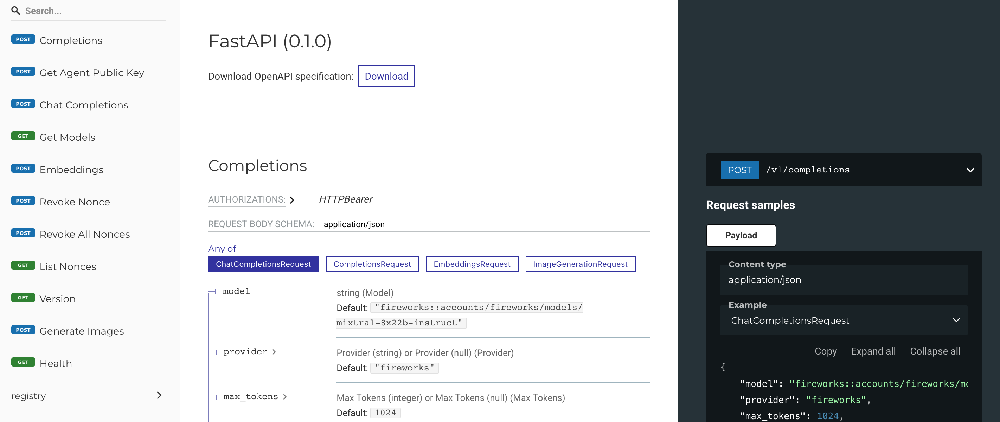
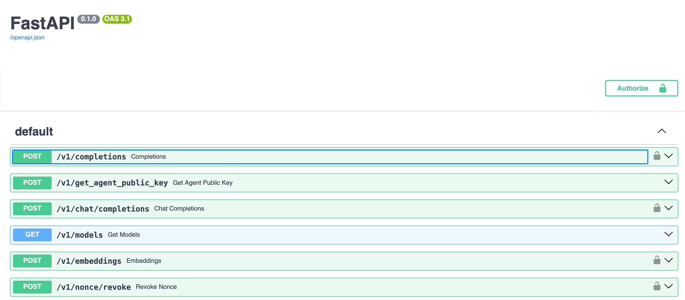

# API Basics

NEAR AI provides a standard Web API based on OpenAPI to interact with the Developer Hub, allowing powerful backend integrations.

In this article you'll find information on how to generate a valid `auth` token to use the API, and links to the API reference documentation:

- [Using the API](#using-the-api)
- [API documentation](#api-documentation)
- [Interactive API](#interactive-api)

## Using the API

To use the Near AI [Web API methods](https://api.near.ai/api/hub/standard), you'll need an [authorization token](#auth-token) generated from your NEAR account.

In the next section, you can find detailed information about the `auth` bearer token, and how it [can be generated](#generate-the-token) in a programmatic way.

### Auth token

The `auth` bearer token is a stringyfied JSON that must contain `account_id`, `public_key`, `signature`, `nonce`, and `message` (it can also include some optional fields).

For example, this object:

```json
{
  "account_id": "demoaccount.near",
  "public_key": "ed25519:G59i7tou.....QGUrfSkeJ",
  "signature": "P6fZ5bp9j.....Z7BvtqDQ==",
  "callback_url": "https://app.near.ai/sign-in/callback",
  "message": "Welcome to NEAR AI Hub!",
  "recipient": "ai.near",
  "nonce": "00000000000000000001741287395592"
}
```

Becomes a string token:

```txt
auth:'{"account_id":"demoaccount.near","public_key":"ed25519:G59i7touKk.....QGUrfSkeJ","signature":"P6fZ5bp9j.....BVTZ7BvtqDQ==","callback_url":"https://app.near.ai/sign-in/callback","message":"Welcome to NEAR AI Hub!","recipient":"ai.near","nonce":"00000000000000000001741287395592"}'
```

!!! tip
	If you're logged into [app.near.ai](https://app.near.ai), you can grab the token out of the `auth` cookie. For example:

	```
	auth:"%7B%22account_id%22%3A%22demoaccount.near%22%2C%22public_key%22%3A%22ed25519%3AG59i7tou.....QGUrfSkeJ%22%2C%22signature%22%3A%22P6fZ5bp9j.....Z7BvtqDQ%3D%3D%22%2C%22callback_url%22%3A%22https%3A%2F%2Fapp.near.ai%2Fsign-in%2Fcallback%22%2C%22message%22%3A%22Welcome%20to%20NEAR%20AI%20Hub!%22%2C%22recipient%22%3A%22ai.near%22%2C%22nonce%22%3A%2200000000000000000001741287395592%22%7D"
	```

### Generate the token

You can also generate the `auth` bearer token using your preferred programming language.
In this section you can find a few code samples using Python, Rust, and JavaScript.

=== "Python"

	This code example uses the `nearai` CLI to complete the authentication process, and then generates the `auth` token.
	For additional details, check the [full implementation](https://github.com/nearai/nearai_langchain/blob/main/nearai_langchain/local_config.py).

	```py
	import shlex
	import sys
	import fire  # type: ignore
	
	from nearai.cli import LoginCLI  # type: ignore
	from nearai.config import load_config  # type: ignore
	from nearai.shared.client_config import ClientConfig  # type: ignore
	
	def get_nearai_client_config() -> ClientConfig:
	  config = load_config()
	  if self.config.auth is None:
	    print("Attempt to get local client config, nearai_langchain v ^0.0.11")
	    print("NearAI authentication required. Running web-based login...")
	    command = "nearai login --remote"
	    sys.argv = shlex.split(command)
	    fire.Fire(CLI)
	
	    # Note: At this point, the user needs to:
	    # 1. Follow the auth URL that will be printed
	    # 2. Complete the authentication process
	    # 3. Get the login save command with parameters
	
	    save_command = input("Please enter the login save command: ")
	    sys.argv = shlex.split(save_command)  # Properly splits command respecting quotes
	    fire.Fire(CLI)
	
	    config = load_config()
	  return config.get_client_config()
	
	
	def generate_nearai_auth_token(config: ClientConfig):
	  auth_bearer_token = config.auth.generate_bearer_token()
	  new_token = json.loads(auth_bearer_token)
	  new_token["runner_data"] = json.dumps(
	    {"agent": "", "runner_api_key": ""}
	  )
	  auth_bearer_token = json.dumps(new_token)
	  return auth_bearer_token
	
	
	api_key = generate_nearai_auth_token(get_nearai_client_config())
	```

=== "JavaScript"

	This JS code example uses the Wallet selector to complete the authentication process, and then generates the `auth` token.
	For additional information, you can check the [complete Next.js implementation](https://github.com/prakhar728/near-ai-web-starter).

	```js
	export const NEAR_AI_AUTH_OBJECT_STORAGE_KEY = "NearAIAuthObject";
	
	export async function handleNearAILoginCallback() {
	  const callbackparams = new URLSearchParams(location.hash);
	  const accountId = callbackparams.get("#accountId");
	
	  if (accountId) {
	    const nearaiauthobject = JSON.parse(
	      localStorage?.getItem(NEAR_AI_AUTH_OBJECT_STORAGE_KEY),
	    );
	    nearaiauthobject.account_id = accountId;
	    nearaiauthobject.signature = callbackparams.get("signature");
	    nearaiauthobject.public_key = callbackparams.get("publicKey");
	    localStorage.setItem(
	      NEAR_AI_AUTH_OBJECT_STORAGE_KEY,
	      JSON.stringify(nearaiauthobject),
	    );
	    location.hash = "";
	  }
	}
	
	export async function nearAIlogin(wallet, message) {
	  // Generate nonce based on current time in milliseconds
	  const nonce = new String(Date.now());
	  const nonceBuffer = Buffer.from(
	    new TextEncoder().encode(nonce.padStart(32, "0")),
	  );
	
	  const recipient = "ai.near";
	  const callbackUrl = location.href;
	
	  const authObject = {
	    message,
	    nonce,
	    recipient,
	    callback_url: callbackUrl,
	    signature:"",
	    account_id: "",
	    public_key: ""
	  };
	
	  localStorage.setItem(
	    NEAR_AI_AUTH_OBJECT_STORAGE_KEY,
	    JSON.stringify(authObject),
	  );
	  const signedMessage = await wallet.signMessage({
	    message,
	    nonce: nonceBuffer,
	    recipient,
	    callbackUrl,
	  });
	
	  authObject.signature = signedMessage.signature;
	  authObject.account_id = signedMessage.accountId;
	  authObject.public_key = signedMessage.publicKey;
	
	  localStorage.setItem(
	    NEAR_AI_AUTH_OBJECT_STORAGE_KEY,
	    JSON.stringify(authObject),
	  );
	
	  return authObject;
	}
	```

=== "Rust"

	This code example builds the auth payload, signs it using the [`sign_message_nep413()`](https://docs.rs/near-api/latest/near_api/signer/trait.SignerTrait.html#method.sign_message_nep413) method, and stringifies the JSON result to generate the `auth` token.
	For additional information, see [full implementation](https://github.com/INTEARnear/Tear/blob/main/agents/src/near_ai.rs#L169).

	```rs
	async fn get_api_key(account: SelectedAccount) -> Result<String, anyhow::Error> {
	    let nonce = SystemTime::now()
	        .duration_since(UNIX_EPOCH)
	        .unwrap()
	        .as_millis();
	    let payload = NEP413Payload {
	        message: "Welcome to NEAR AI".to_string(),
	        recipient: "ai.near".to_string(),
	        nonce: [
	            vec!['0' as u8; 32 - nonce.to_string().as_bytes().len()],
	            nonce.to_string().as_bytes().to_vec(),
	        ]
	        .concat()
	        .try_into()
	        .unwrap(),
	        callback_url: Some("https://example.callback.url".to_string()),
	    };
	    let signature = account
	        .signer
	        .sign_message_nep413(
	            account.account_id.clone(),
	            account.public_key.clone(),
	            payload.clone(),
	        )
	        .await?;
	    Ok(serde_json::to_string(&serde_json::json!({
	        "account_id": account.account_id,
	        "signature": BASE64_STANDARD.encode(match signature {
	            Signature::ED25519(sig) => sig.to_bytes(),
	            Signature::SECP256K1(_) => unreachable!(), // we're working only with ed25519 on trading bot side
	        }),
	        "public_key": account.public_key,
	        "nonce": nonce.to_string(),
	        "recipient": payload.recipient,
	        "message": payload.message,
	        "callback_url": payload.callback_url,
	        "on_behalf_of": null,
	    }))?)
	}
	```

## API documentation

You can find complete and detailed technical reference documentation regarding available NEAR AI API methods in [this page](https://api.near.ai/docs/hub/reference).



Reference documentation includes:

- Request schemas
- Query parameters
- Responses
- Response schemas

**API Endpoints reference documentation**

| Link 			| Description |
|---------------|-------------|
| [Default](https://api.near.ai/docs/hub/reference)		| Main Hub methods. |
| [Registry](https://api.near.ai/docs/hub/reference#tag/registry)		| Registry management methods. |
| [Agents & Assistants](https://api.near.ai/docs/hub/reference#tag/agents-assistants)	| Agent management methods. |
| [Benchmark](https://api.near.ai/docs/hub/reference#tag/benchmark)		| Benchmarking methods. |
| [Stars](https://api.near.ai/docs/hub/reference#tag/stars)				| Star management methods. |
| [Jobs](https://api.near.ai/docs/hub/reference#tag/jobs)				| Jobs management methods. |
| [Permissions](https://api.near.ai/docs/hub/reference#tag/permissions)	| Permission methods. |
| [Evaluation](https://api.near.ai/docs/hub/reference#tag/evaluation)	| Evaluation methods. |
| [Delegation](https://api.near.ai/docs/hub/reference#tag/delegation)	| Delegation management methods. |
| [Logs](https://api.near.ai/docs/hub/reference#tag/logs)				| Logging methods. |
| [Vector Stores](https://api.near.ai/docs/hub/reference#tag/Vector-Stores)		| Vector Store management methods. |
| [Files](https://api.near.ai/docs/hub/reference#tag/Files)				| File management methods. |
| [Threads](https://api.near.ai/docs/hub/reference#tag/Threads)			| Thread management methods. |
| [Hub Secrets](https://api.near.ai/docs/hub/reference#tag/Hub-Secrets)	| Manage Hub secrets. |
| [Run Schedule](https://api.near.ai/docs/hub/reference#tag/Run-Schedule)		| Scheduling methods. |


## Interactive API

NEAR AI also provides an [interactive Web API](https://api.near.ai/docs/hub/interactive) based on [Swagger UI](https://swagger.io/) that allows you to visualize and interact with NEAR AI API’s resources without having any of the implementation logic in place.

The interactive API is automatically generated from the OpenAPI specification, providing a simple API tool for back end implementation and client side consumption.

!!! info
	Please note that to execute API calls using this interactive tool, you need to provide a valid authentication token. Check [this section](#auth-token) to learn more about generating your `auth` token.




**Interactive API Endpoints**

- [Default](https://api.near.ai/docs/hub/interactive)
- [Registry](https://api.near.ai/docs/hub/interactive#/registry)
- [Agents & Assistants](https://api.near.ai/docs/hub/interactive#/agents%2C%20assistants)
- [Benchmark](https://api.near.ai/docs/hub/interactive#/benchmark)
- [Stars](https://api.near.ai/docs/hub/interactive#/stars)
- [Jobs](https://api.near.ai/docs/hub/interactive#/jobs)
- [Permissions](https://api.near.ai/docs/hub/interactive#/permissions)
- [Evaluation](https://api.near.ai/docs/hub/interactive#/evaluation)
- [Delegation](https://api.near.ai/docs/hub/interactive#/delegation)
- [Logs](https://api.near.ai/docs/hub/interactive#/logs)
- [Vector Stores](https://api.near.ai/docs/hub/interactive#/Vector%20Stores)
- [Files](https://api.near.ai/docs/hub/interactive#/Files)
- [Threads](https://api.near.ai/docs/hub/interactive#/Threads)
- [Hub Secrets](https://api.near.ai/docs/hub/interactive#/Hub%20Secrets)
- [Run Schedule](https://api.near.ai/docs/hub/interactive#/Run%20Schedule)
