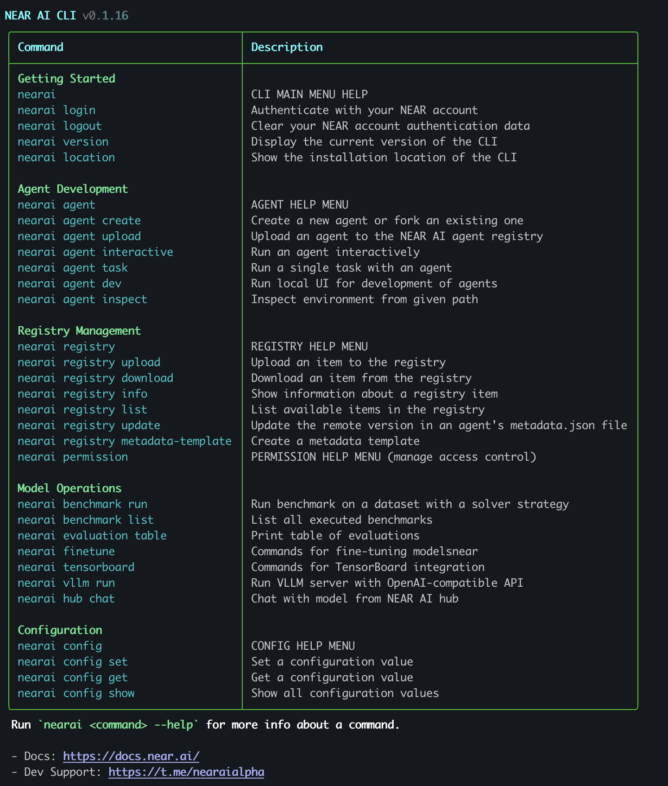

# NEAR AI CLI

NEAR AI CLI allows you to [create and deploy agents](./agents/quickstart.md), [train and test models](./models/home.md), and more!

---

## Quickstart

### Requirements

- Python 3.9 - 3.11 **(3.12 - 3.13 is NOT supported)**
- [NEAR Account](#login-to-near-ai)

Additionally, we recommend creating a virtual environment to avoid conflicts with other Python packages.

=== "uv"

    ```bash
    # Create a virtual environment with python 3.11
    uv venv --python 3.11
    source .venv/bin/activate
    ```

=== "conda"

    ```bash
    # Create a virtual environment with python 3.11
    conda create -n nearai python=3.11
    conda activate nearai
    ```

=== "pyenv" 

    ```bash
    # Install python 3.11
    pyenv install 3.11
    pyenv local 3.11

    # Create a virtual environment
    python -m venv .venv
    source .venv/bin/activate
    ```

---

### Installing NEAR AI CLI

=== "pip"

    ``` bash
    pip install nearai  # OR: python3 -m pip install nearai
    ```

=== "local"

    ``` bash
    # Clone the repository:
    git clone git@github.com:nearai/nearai.git
    cd nearai

    # Install dependencies:
    pip install -e .  # OR: python3 -m pip install -e .
    ```


!!! warning "Python version"
    NEAR AI requires python **`3.9 - 3.11`**. We recommend you to [create a virtual environment](#requirements) to avoid conflicts with other Python packages or globally installing dependencies if installing locally w/ repo. 

---


### Account Creation & Login

To create a new agent, first login with a NEAR Account. If you don't have one, we recommend creating a free account with [Meteor Wallet](https://wallet.meteorwallet.app). 

After you've created an account run:

``` bash
nearai login # OR nearai login --remote
```

Example:

``` bash
$> nearai login

Please visit the following URL to complete the login process: https://auth.near.ai?message=Welcome+to+NEAR+AI&nonce=<xyzxyzxyzxyzx>&recipient=ai.near&callbackUrl=http%3A%2F%2Flocalhost%3A63130%2Fcapture
```

After successfully logging in, you will see a confirmation screen: 


Close this window and return to your terminal. 

Setup complete! You can now proceed to [Agent Quickstart](./agents/quickstart.md) and create your first AI Agent! 🚀

!!! info "Other Login Methods"

    If you have already logged in on `near-cli`, you know your account's private key, or you have the credentials on another device, you can use the following commands to login:

    ```bash
    ### Login with NEAR Account ID Only
    nearai login --accountId name.near

    ### Login with Account ID and Private Key
    nearai login --accountId name.near --privateKey key

    ### Login Remotely (only displays the login URL)
    nearai login --remote
    ```

    See [reference docs below](#account-management) for more info on account management.

---

## NEAR AI CLI Reference Docs

Here is a complete reference guide for all NEAR AI CLI commands, their usage, and examples. Use the right navigation menu to quickly jump to an area of interest.

- [Account Management](#account-management)
- [Agent Development](#agent-development)
- [Registry Management](#registry-management)
- [Model Operations](#model-operations)
- [Configuration](#configuration)

!!! tip
    At any time you can use the `--help` flag in NEAR AI CLI for more information about a command or group of commands along with example usage.

    Additionally, simply running `nearai` in your terminal will display a full list of all commands:

    

---

## Account Management

### `login`

Authenticate with your NEAR account.

Syntax:
```
nearai login [--remote] [--auth_url=<auth_url>] [--accountId=<accountId>] [--privateKey=<privateKey>]
```

Example:
```
nearai login --accountId my_near_account.near
```

### `login status`

Display login status and auth details.

Syntax:
```
nearai login status
```

### `login save`

Save NEAR account authorization data.

Syntax:
```
nearai login save --accountId=<accountId> --signature=<signature> --publicKey=<publicKey> --callbackUrl=<callbackUrl> --nonce=<nonce>
```

### `logout`

Clear your NEAR account authentication data.

Syntax:
```
nearai logout
```

### `location`

Show the installation location of the `nearai` CLI.

Syntax:
```
nearai location
```

### `version`

 Display the current version of the `nearai` CLI.

Syntax:
```
nearai version
```

---

## Agent Development

Agent commands allow you to create and interact with agents by running them locally or via NEAR AI Cloud.

### `agent dev`

Run a local development UI for agents that have their own UI.
This launches a local server for testing and developing agent functionality in a browser-based environment.

Syntax:
```
nearai agent dev
```

### `agent inspect`

Inspect the environment and contents of an agent at the specified path.
This launches a Streamlit interface showing the agent's structure, code, and metadata.

Syntax:
```
nearai agent inspect <path>
```

Example:
```
nearai agent inspect ./my_agent
```

### `agent interactive`

Run an agent interactively in a conversational interface. If no agent is specified, you'll be presented with a list of available agents to choose from.
Specifying an agent will run the agent from NEAR AI Cloud. If you want to run a specific local agent, pass the path to the agent followed by the `--local` flag.

Syntax:
```
nearai agent interactive [--agent=<agent>] [--thread_id=<thread_id>] [--tool_resources=<tool_resources>] [--local] [--verbose] [--env_vars=<env_vars>]
```

Example:
```
nearai agent interactive --agent=namespace/agent_name/1.0.0 --local --verbose
```

### `agent task`

Run a single non-interactive task with an agent. The agent will process the task and return its response. This is useful for automation or when you don't need an ongoing conversation.

Syntax:
```
nearai agent task <agent> <task> [--thread_id=<thread_id>] [--tool_resources=<tool_resources>] [--file_ids=<file_ids>] [--local] [--verbose] [--env_vars=<env_vars>]
```

Example:
```
nearai agent task namespace/agent_name/1.0.0 "Summarize this text" --local --verbose
```

### `agent create`

Create a new AI agent from scratch or fork existing ones.

Syntax:
```
nearai agent create [--name=<name>] [--description=<description>] [--fork=<fork>]
```

Example:
```
nearai agent create --name my_new_agent --description "A new AI agent"
```

### `agent upload`

Upload an item to the NEAR AI registry for public use.

Syntax:
```
nearai agent upload [--local_path=<path>] [--bump] [--minor_bump] [--major_bump]
```

Example:
```
nearai agent upload --local_path=./my_agent --bump
```

---

## Registry Management

**Registry Commands**

Manage items in the NEAR AI Registry including agents, models, datasets, and evaluations.
These commands allow you to upload, download, update, and list available items in the NEAR AI Registry.

**Permission Commands**

Commands for managing permissions and access control for NEAR AI resources.

- [`permission grant`](#permission-grant)
- [`permission revoke`](#permission-revoke)

### `registry info`

Display detailed information about a registry item. Includes metadata and available provider matches for models.

Syntax:
```
nearai registry info <entry>
```

Example:
```
nearai registry info namespace/agent_name/1.0.0
```

### `registry metadata-template`

This generates a properly formatted `metadata.json` file with default values that can be customized for your agent or model.

Syntax:
```
nearai registry metadata-template [--local_path=<path>] [--category=<category>] [--description=<description>]
```

Example:
```
nearai registry metadata-template --local_path=./my_agent --category=agent --description="My new agent"
```

### `registry list`

List available items in the NEAR AI registry. You can filter the results by namespace, category, tags, and other criteria to find specific items.

Syntax:
```
nearai registry list [--namespace=<namespace>] [--category=<category>] [--tags=<tags>] [--total=<total>] [--offset=<offset>] [--show_all] [--show_latest_version] [--star=<star>]
```

Example:
```
nearai registry list --category=agent --tags=nlp,chatbot --total=10
```

### `registry update`

Update the remote metadata of an item in the NEAR AI Registry.
Looks for a `metadata.json` file in the given directory and updates the remote metadata with the new values.

Syntax:
```
nearai registry update [--local_path=<path>]
```

Example:
```
nearai registry update --local_path=./my_agent
```

### `registry upload-unregistered-common-provider-models`

Creates new registry items for unregistered common provider models.
This command helps keep the registry up-to-date with the latest models from various providers.

Syntax:
```
nearai registry upload-unregistered-common-provider-models [--dry_run=<bool>]
```

Example:
```
nearai registry upload-unregistered-common-provider-models --dry_run=False
```

### `registry upload`

Upload an item to the NEAR AI registry for public use.

Syntax:
```
nearai registry upload [--local_path=<path>] [--bump] [--minor_bump] [--major_bump]
```

Example:
```
nearai registry upload --local_path=./my_agent --bump
```

### `registry download`

Download an item from the NEAR AI registry to your local machine. This allows you to use or inspect agents, models, datasets, etc. that have been published by others.

Syntax:
```
nearai registry download <entry_location> [--force]
```

Example:
```
nearai registry download namespace/agent_name/1.0.0 --force
```

### `permission grant`

Grant a specific permission to a NEAR account. This command allows you to grant a specific permission to a NEAR account, enabling them to access certain NEAR AI resources or perform specific actions.

Syntax:
```
nearai permission grant <account_id> <permission>
```

Example:
```
nearai permission grant alice.near read_access
```

### `permission revoke`

Revoke permissions from a NEAR account. If no permission is specified, all permissions will be revoked from the account.

Syntax:
```
nearai permission revoke <account_id> [--permission=<permission>]
```

Example:
```
nearai permission revoke bob.near --permission=write_access
```

---

## Model Operations

### `benchmark run`

Run benchmark on a dataset with a solver strategy.
This command executes a benchmark on a specified dataset using a given solver strategy.
Results are cached in the database for subsequent runs unless `--force` is used.

Syntax:
```
nearai benchmark run <dataset> <solver_strategy> [--max_concurrent=<int>] [--force] [--subset=<subset>] [--check_compatibility] [--record] [--num_inference_retries=<int>] [--solver_args...]
```

Example:
```
nearai benchmark run my_dataset my_solver --max_concurrent=4 --force --record
```

### `benchmark list`

List all executed benchmarks. This command displays a table of all executed benchmarks, with options to filter by namespace, benchmark name, solver name, and solver arguments.
Results are paginated using limit and offset parameters.

Syntax:
```
nearai benchmark list [--namespace=<namespace>] [--benchmark=<benchmark>] [--solver=<solver>] [--args=<args>] [--total=<total>] [--offset=<offset>]
```

Example:
```
nearai benchmark list --namespace=my_namespace --total=20
```

### `evaluation table`

Displays a table of all evaluation results, with options to customize the display of columns and metrics.
The table can be configured to show all key columns and metrics, or a limited subset for better readability.

Syntax:
```
nearai evaluation table [--all_key_columns] [--all_metrics] [--num_columns=<int>] [--metric_name_max_length=<int>]
```

Example:
```
nearai evaluation table --all_metrics --num_columns=8
```

### `evaluation read-solutions`

Reads `solutions.json` from an evaluation entry.
It can filter solutions by status and show either concise or verbose output for each solution.

Syntax:
```
nearai evaluation read-solutions <entry> [--status=<bool>] [--verbose]
```

Example:
```
nearai evaluation read-solutions namespace/evaluation_name/1.0.0 --status=True
```


### `hub chat`

Chat with a model from the NEAR AI hub. This command allows you to interact with language models hosted on the NEAR AI hub.
You can specify which model to use, which provider to use, and customize the chat experience with various parameters.

Syntax:
```
nearai hub chat [--query=<query>] [--endpoint=<endpoint>] [--model=<model>] [--provider=<provider>] [--info]
```

Example:
```
nearai hub chat --query="What is AI?" --model=gpt-3.5-turbo
```

### `tensorboard start`

TensorBoard integration.

Syntax:
```
nearai tensorboard start <logdir> [--limit=<limit>] [--timeout=<timeout>]
```

Example:
```
nearai tensorboard start /tmp/log --limit=200
```

### `vllm run`

Run a VLLM server with an OpenAI-compatible API for local inference.
This command starts a VLLM server that provides an OpenAI-compatible API for running language models locally.
The server supports various configuration options for optimizing performance and resource utilization.

Syntax:
```
nearai vllm run
```

Example:
```
nearai vllm run
```

### `finetune inspect`

Commands for fine-tuning models.

Syntax:
```
nearai finetune inspect <job_id>
```

Example:
```
nearai finetune inspect myJobId
```

### `finetune start`

Start a fine-tuning job on the current node.

Syntax:
```
nearai finetune start
```

Example:
```
nearai finetune start
```

---

## Configuration

Configuration commands help you manage your NEAR AI CLI settings.
You can view, set, and modify various configuration values that control how the CLI behaves.

**Configuration Commands**

- [`config set`](#config-set)
- [`config get`](#config-get)
- [`config show`](#config-show)

### `config set`

Add a key-value pair to the config file.

Syntax:
```
nearai config set <key> <value> [--local]
```

Example:
```
nearai config set api_url https://api.example.com
```

### `config get`

Get the value of a key from the config file.

Syntax:
```
nearai config get <key>
```

Example:
```
nearai config get api_url
```

### `config show`

Show all configuration values.

Syntax:
```
nearai config show
```

---

## Miscellaneous Commands

### `submit`

Submit a task to be executed by a worker.

Syntax:
```
nearai submit [--path=<path>] [--worker_kind=<worker_kind>]
```

Example:
```
nearai submit --path=./my_task --worker_kind=GPU_8_A100
```

