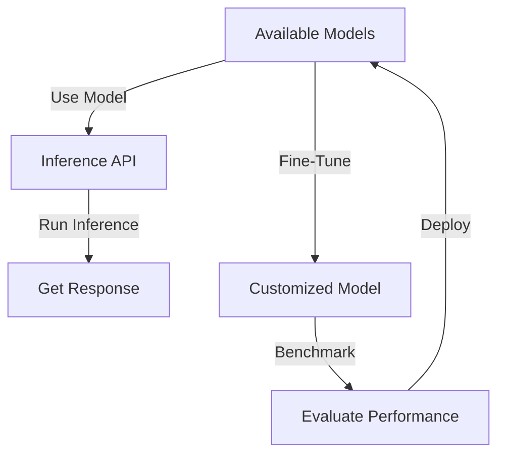

# Home

NEAR AI provides access to powerful **open-source AI models** including **Llama**, **Qwen**, **Deepseek** and **Stable Diffusion**, leveraging various AI providers to deliver high-quality responses.

Seamlessly find, tune and integrate models into your applications for **chat completions**, **image creation**, and **function calling**.

!!! tip
    Are you looking to use the model in an agent? Check out the [**Agents Guide**](../agents/quickstart.md).

---

## ⚠️ Prerequisites

Before you start using NEAR AI models, please make sure you have the [NEAR AI CLI](../cli.md) installed and have logged in with your Near wallet.

---

## Listing Available Models

You can find a non-exhaustive list of models available on NEAR AI in the [Web Hub](https://app.near.ai/models). If you want to find all supported models on NEAR AI, run the following Python script:

```python
import openai
import json
import nearai

hub_url = "https://api.near.ai/v1"
auth = nearai.config.load_config_file()["auth"]
signature = json.dumps(auth)

client = openai.OpenAI(base_url=hub_url, api_key=signature)

models = client.models.list()
print(models)
```

!!! warning
    Remember to use the [NEAR CLI](../cli.md) to login using your [NEAR wallet](../cli.md#login-to-near-ai)
  
    ```bash
    $> nearai login
    ```


??? example "Output"
    ```python
    {'fireworks': 'fireworks::accounts/yi-01-ai/models/yi-large'}, NamespacedName(name='aiderlm0', namespace='melse0299e'): {'fireworks': 'fireworks::accounts/mels-e0299e/models/aiderlm-v0'}, NamespacedName(name='flux1schnellfp8', namespace=''): {'fireworks': 'fireworks::accounts/fireworks/models/flux-1-schnell-fp8'}, NamespacedName(name='flux1devfp8', namespace=''): {'fireworks': 'fireworks::accounts/fireworks/models/flux-1-dev-fp8'}, NamespacedName(name='mistralsmall24binstruct2501', namespace=''): {'fireworks': 'fireworks::accounts/fireworks/models/mistral-small-24b-instruct-2501'}, NamespacedName(name='deepseekr1', namespace=''): {'fireworks': 'fireworks::accounts/fireworks/models/deepseek-r1'}, NamespacedName(name='mixtral8x22binstruct', namespace=''): {'fireworks': 'fireworks::accounts/fireworks/models/mixtral-8x22b-instruct'}, NamespacedName(name='llama3_8binstruct', namespace=''): {'fireworks': 'fireworks::accounts/fireworks/models/llama-v3-8b-instruct'}, NamespacedName(name='deepseek3', namespace=''): {'fireworks': 'fireworks::accounts/fireworks/models/deepseek-v3'}, NamespacedName(name='qwq32bpreview', namespace=''): {'fireworks': 'fireworks::accounts/fireworks/models/qwen-qwq-32b-preview'}, NamespacedName(name='llama3p1_405binstruct', namespace=''): {'fireworks': 'fireworks::accounts/fireworks/models/llama-v3p1-405b-instruct'}, NamespacedName(name='llama3p1_8binstruct', namespace=''): {'fireworks': 'fireworks::accounts/fireworks/models/llama-v3p1-8b-instruct'}, NamespacedName(name='llama3_8binstructhf', namespace=''): {'fireworks': 'fireworks::accounts/fireworks/models/llama-v3-8b-instruct-hf'}, NamespacedName(name='llama3p2_3binstruct', namespace=''): {'fireworks': 'fireworks::accounts/fireworks/models/llama-v3p2-3b-instruct'}, NamespacedName(name='qwen2p5_72binstruct', namespace=''): {'fireworks': 'fireworks::accounts/fireworks/models/qwen2p5-72b-instruct'}, NamespacedName(name='llama3p1_405binstructlong', namespace=''): {'fireworks': 'fireworks::accounts/fireworks/models/llama-v3p1-405b-instruct-long'}, NamespacedName(name='llama3p1_70binstruct', namespace=''): {'fireworks': 'fireworks::accounts/fireworks/models/llama-v3p1-70b-instruct'}, NamespacedName(name='llama3_70binstruct', namespace=''): {'fireworks': 'fireworks::accounts/fireworks/models/llama-v3-70b-instruct'}, NamespacedName(name='llama3p2_90bvisioninstruct', namespace=''): {'fireworks': 'fireworks::accounts/fireworks/models/llama-v3p2-90b-vision-instruct'}, NamespacedName(name='llama3p3_70binstruct', namespace=''): {'fireworks': 'fireworks::accounts/fireworks/models/llama-v3p3-70b-instruct'}, NamespacedName(name='qwen2p5coder32binstruct', namespace=''): {'fireworks': 'fireworks::accounts/fireworks/models/qwen2p5-coder-32b-instruct'}, NamespacedName(name='qwen2vl72binstruct', namespace=''): {'fireworks': 'fireworks::accounts/fireworks/models/qwen2-vl-72b-instruct'}, NamespacedName(name='llama3p2_11bvisioninstruct', namespace=''): {'fireworks': 'fireworks::accounts/fireworks/models/llama-v3p2-11b-vision-instruct'}, NamespacedName(name='llamaguard3_8b', namespace=''): {'fireworks': 'fireworks::accounts/fireworks/models/llama-guard-3-8b'}, NamespacedName(name='phi3vision128kinstruct', namespace=''): {'fireworks': 'fireworks::accounts/fireworks/models/phi-3-vision-128k-instruct'}, NamespacedName(name='dobbyminileashedllama3_18b', namespace='sentientfoundation'): {'fireworks': 'fireworks::accounts/sentientfoundation/models/dobby-mini-leashed-llama-3-1-8b'}, NamespacedName(name='dobbyminiunhingedllama3_18b', namespace='sentientfoundation'): {'fireworks': 'fireworks::accounts/sentientfoundation/models/dobby-mini-unhinged-llama-3-1-8b'}, NamespacedName(name='statetransitionllama3p1', namespace='marco0dece6'): {'fireworks': 'fireworks::accounts/marco-0dece6/models/state-transition-llama3p1'}, NamespacedName(name='mixtral8x7binstruct', namespace=''): {'fireworks': 'fireworks::accounts/fireworks/models/mixtral-8x7b-instruct'}, NamespacedName(name='mythomaxl2_13b', namespace=''): {'fireworks': 'fireworks::accounts/fireworks/models/mythomax-l2-13b'}, NamespacedName(name='tsr3', namespace='guzmanesneider75_94d6ba'): {'fireworks': 'fireworks::accounts/guzmanesneider75-94d6ba/models/tsr3'}, NamespacedName(name='serviceemergencyclassifierllama3_8binstruct', namespace='carlos0f74b3'): {'fireworks': 'fireworks::accounts/carlos-0f74b3/models/service-emergency-classifier-llama3-8b-instruct'}
    ```

    Each model follows the format: `provider::account/model_name/model_version`. To list all providers:

    ```python
    providers = set([model.id.split("::")[0] for model in models])
    print(providers)
    ```

---

## Working with AI Models

When working with AI models, you will either want to directly use a model for inference, or fine-tune it for a specific use case.

- [**Fine-Tuning**](./fine_tuning.md) – Customize models for specific use cases.
- [**Benchmarks & Evaluations**](./benchmarks_and_evaluations.md) – Assess model performance.
- [**Running Inference**](../agents/env/inference.md) – Execute models for AI responses.

