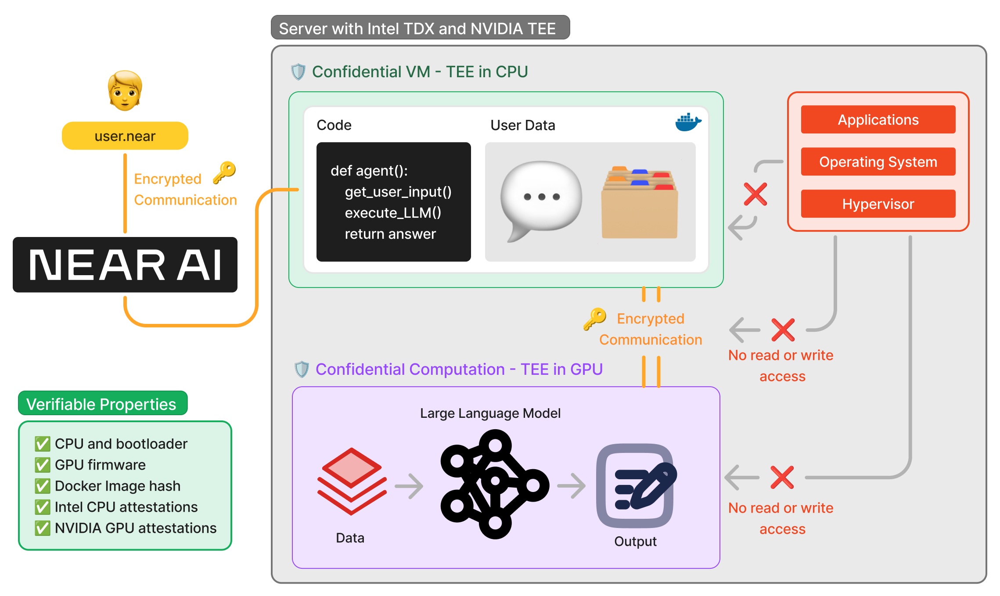

# Private and Verifiable AI

Thanks to a combination of cryptographic techniques and secure hardware, NEAR AI is private and verifiable every step of the way. From agent interactions to model training, our infrastructure ensures data privacy and result integrity throughout the entire process.

NEAR AI leverages technology from Intel and NVIDIA to keep your data safe and isolated

To execute an agent securely, NEAR AI uses Intel TDX technology to create a [Confidential Virtual Machine (CVM)](https://www.intel.com/content/www/us/en/developer/tools/trust-domain-extensions/overview.htmlml). This CVM is a virtual machine that runs in an isolated environment within the CPU, where a Docker container containing the agent's code and user data is deployed and executed. 

For model inference, an encrypted communication channel is established using NVIDIA TEE technology, which creates a [Confidential Space within the GPU](https://www.nvidia.com/en-us/data-center/solutions/confidential-computing/). The model runs in this isolated environment, protected from external access.

It's important to note that the CPU and GPU Confidential Spaces operate in **complete isolation** from the rest of the system - neither the operating system nor the hypervisor (VM manager) can access the code or data being processed.

??? note "Want to dive deeper?"

    All technology that powers NEAR AI is open-sourced. If you want to dive deeper and learn more about how this secure and private AI is being developed, check out the [Private ML SDK](https://github.com/nearai/private-ml-sdk) on GitHub. 

---

## How Can I Trust It?

Before deployment, NEAR AI verifies both proper hardware configuration and Docker container image hash integrity. This ensures a secure runtime environment and that the exact code being executed matches expectations.

After execution, NEAR AI validates security through TEE attestations - cryptographic proofs verify both a secure environment and data/code integrity. 

You can view and verify these attestations yourself or publish them on-chain with NEAR Protocol to allow anyone to verify them. This provides a cryptographically verifiable chain of trust through the entire stack from agent to inference to hardware; all the way down to the certifications from the chip manufacturers.

---

## How Can I Use it?

Right now we are beta testing this technology, but soon we will open for public use. In the near future, all agents and models will run in this secure environment, ensuring that your data is always safe and the results are correct.

[Stay tuned for more updates!](https://x.com/near_ai)
