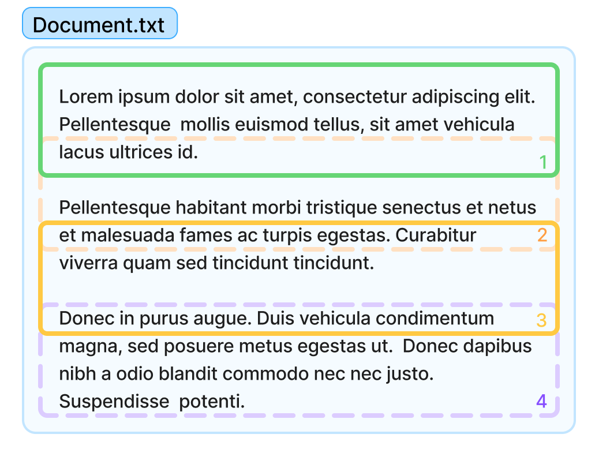

# Chunking

Before converting documentation into vector embeddings, the NEAR AI platform segments the text into smaller, manageable chunks.

This process - known as text chunking - makes it easier to process the documents, while allowing the model to better represent the information within each document.

!!! tip
    Embedding models transform documents into fixed-size vectors, regardless of the original document size.
    
    By dividing documents into smaller chunks we can achieve a granular and accurate representation, since a single vector cannot capture a entire document's meaning.

!!! warning
    Most users won't need to modify the default chunking settings. Only consider adjusting them if you notice the agent consistently struggles to answer questions due to how the documents are segmented.

---

## Chunking Strategy

When creating the vector store we left a parameter commented out in the code - `chunking_strategy`. This parameter allows you to specify how the documents are "split" into chunks before being processed by the model.

```python
vs = client.vector_stores.create(
    name="docs-vector-store-chunks",
    file_ids=file_ids,
    # chunking_strategy={
    #     "chunk_overlap_tokens": 400,
    #     "max_chunk_size_tokens": 800
    # }
)
```

The `chunking_strategy` parameter is a dictionary that can have the following keys:

- `chunk_overlap_tokens`: Number of tokens that chunks will overlap. _(Default 400)_
- `max_chunk_size_tokens`: Max number of tokens that a chunk can have. _(Default 800)_



It is important to notice that chunks are not created based on the document's structure, but merely on counting tokens, which can lead to a loss of context.

Make sure you change the `chunking_strategy` to better fit your documents' structure. For example, if your documents have a lot of code snippets, you can increase the `size` and `overlap` to make sure that the code can be correctly retrieved by the vector store.

Additionally, you can use embedding models that are able to understand the document's structure and create chunks accordingly. We'll cover this in the next section.