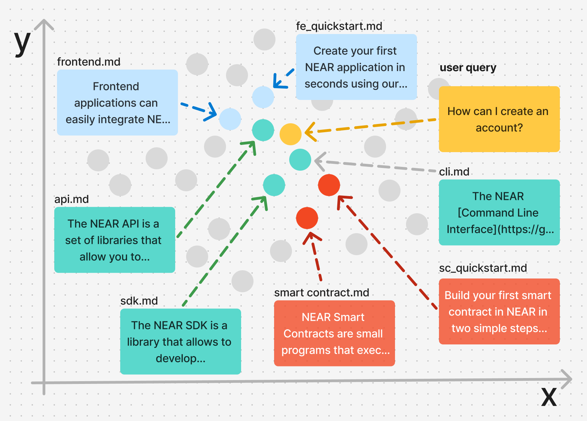

Vector Stores are a special kind of database that stores documents and allows retrieving them through natural language. 

In our case, we will store all NEAR documentation in a vector store, this way if a user asks "What types of access keys are there in NEAR?", the vector store will help us find our access keys docs, so we can use it to answer the question.

!!! tip
    The Vector Store is built separately from the agent, and can be used in multiple places.

!!! info
    This tutorial assumes OpenAI version 1.66.2 or greater. For previous versions the vector store methods can be found at `client.beta.vector_stores` instead of `client.vector_stores`.

---

## How Vector Stores Work

Vector Stores use AI models to convert text documents into low-dimensional numerical representations that computers can easily process and compare. These vectors are like "fingerprints" of the documents - each one unique, but much smaller than the original text.

For example, the [Nomic v1.5](https://huggingface.co/nomic-ai/nomic-embed-text-v1.5) model can take our entire [`cli.md`](https://github.com/near/docs/blob/master/docs/4.tools/cli.md) documentation file and represent it as a compact vector:

```bash
[0.01025390625, 0.048309326171875, -0.166015625, ... , -0.004741668701171875, -0.048553466796875]
```

Each number in this vector captures some aspect of the document's meaning. Documents with similar meanings will have similar vectors, appearing "closer" to each other in the vector space - like clusters of related topics.

This is powerful because it means we can convert user questions into vectors too - allowing us to find relevant documentation by looking for documents that appear "closest" to the user's question.



When a user asks a question, the vector still will help us find relevant documentation by:

1. Converting their question into a vector
2. Comparing it with all our stored document vectors
3. Retrieving the documents whose vectors are closest to the question's vector

!!!tip
    How these representations are generated is a complex topic that exceeds the scope of this tutorial. For us, it suffices to know that such models already exist and are available for us to use.

---

## Creating a Vector Store

Let's create a vector store using using all of our documentation files in the [dataset](https://github.com/near-examples/docs-ai/tree/main/docs-gpt/dataset).

!!!tip "Didn't download the dataset?"
    If you have not completed the [problem](./problem.md) section yet, you can download the dataset by running the following command:
    ```bash
    curl -L https://api.github.com/repos/near-examples/docs-ai/tarball/main | tar xz --strip=2 '*/docs-gpt/dataset'
    ```


Creating a vector store in NEAR AI consist of 2 main steps:

 1.) **uploading the files** to NEAR AI
 
 2.) **assigning them** to a vector store. 
 

Let's start by uploading the files to NEAR AI. Create a new file called `vector.py` and paste the following code:

```python
import json
from glob import glob

import openai
import nearai

# Load NEAR AI Hub configuration
config = nearai.config.load_config_file()
base_url = config.get("api_url", "https://api.near.ai/") + "v1"
auth = config["auth"]

client = openai.OpenAI(base_url=base_url, api_key=json.dumps(auth))

# Create a vector store for vector store docs
md_files = list(glob("./**/*.md", recursive=True))
file_ids = []

for file_path in md_files:
    print(f"Processing {file_path}")

    with open(file_path, 'r', encoding='utf-8') as file:
        uploaded_file = client.files.create(
            file=(file_path, file.read(), "text/markdown"),
            purpose="assistants"
        )
        file_ids.append(uploaded_file.id)

vs = client.vector_stores.create(
    name="docs-vector-store-chunks",
    file_ids=file_ids,
    # chunking_strategy={
    #     "chunk_overlap_tokens": 400,
    #     "max_chunk_size_tokens": 800
    # }
)

print(vs.id)
```

<hr class="subsection" />

### How it works?

In the code above we are first instantiating an OpenAI compatible client

```python 
# Load NEAR AI Hub configuration
config = nearai.config.load_config_file()
base_url = config.get("api_url", "https://api.near.ai/") + "v1"
auth = config["auth"]

client = openai.OpenAI(base_url=base_url, api_key=json.dumps(auth))
```

!!! note
    While we are using a OpenAI client, the files are being uploaded to the NEAR AI platform, not OpenAI.

Then, we list all markdown files in the current directory and its subdirectories

```python
md_files = list(glob("./**/*.md", recursive=True))
```

For each file, we read its content and upload it to the NEAR AI platform

```python
for file_path in md_files:
    print(f"Processing {file_path}")

    with open(file_path, 'r', encoding='utf-8') as file:
        uploaded_file = client.files.create(
            file=(file_path, file.read(), "text/markdown"),
            purpose="assistants"
        )
        file_ids.append(uploaded_file.id)
```

Finally, we create a vector store with the uploaded files and print its `id`

```python
vs = client.vector_stores.create(
    name="docs-vector-store-chunks",
    file_ids=file_ids,
    # chunking_strategy={
    #     "chunk_overlap_tokens": 400,
    #     "max_chunk_size_tokens": 800
    # }
)

print(vs.id)
```

Now run the script:

```bash
python3 vector.py
```
You should see each file being uploaded to NEAR AI in the console. 

At the end of the script, you will get the `id` of the vector store that was created. This `id` will be used in the next section to build an agent that leverages the knowledge contained on it.

??? tip "Where are the Embeddings?"

    No need to worry about this, the NEAR AI platform abstracts away all the complexity of processing the files to create embeddings, and then storing them in a database to be queried.
    
    You only need to upload the files and the platform will take care of the rest

!!! note "Chunking Strategy"
    In the code above we have commented the `chunking_strategy` parameter, which allows you to specify how the documents are "split" into chunks before being processed by the model.

    Do not worry about this parameter for now, we will come back to it later in this tutorial.

---

## A Note on Preprocessing

While the platform abstracts away the complexity of creating embeddings, it is still a good idea to preprocess the files before uploading them.

In our case, our `markdown` files contain a lot of unnecessary information, such as `imports`, `iframes` and other tags that are simply not relevant for the document's semantics.

Furthermore - and this might be common to many documentation files - our files do not necessarily contain the plain-text code snippets, but instead embed them from external sources (e.g. GitHub). So we need to preprocess them to translate the Github tags into actual code snippets.

In case you are curious, you can file all the preprocessing steps we use for our documentation in the [vector.py script](https://github.com/near-examples/docs-ai/blob/main/docs-gpt/dataset/vector.py#L12-L65)